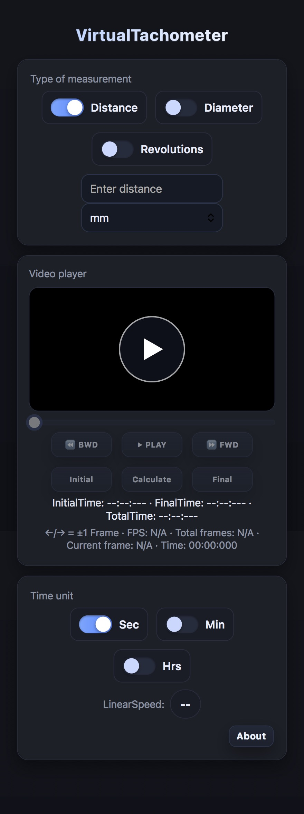

# VirtualTachometer  

> This meter is an industrial tachometer application.  

---

## 📖 About the project

`VirtualTachometer` is a tool designed to `<measure linear and rotational speed from a video>`.  

Some example uses:

- Measure the linear speed of package or bottle conveyors.
- Measure rotational speed (RPM).
- Measure the speed of roller conveyors by converting roller rotational speed into linear speed.

This project was created to solve `<the need to measure speeds when you don’t have available a tachometer>`, for example:

> *“I needed a quick way to confirm the shuttle speed, but nobody in the plant had a tachometer. The only thing I had on hand was my smartphone.”*

---

## ✨ Features

- ✅ Calculates linear and rotational speed based on the time it takes the object to travel a given distance.
- ✅ Support for different units (mm, cm, m, in, ft, etc.).
- ✅ Simple HTML5/JavaScript interface.
- ✅ Support for videos with FPS (30 and 60).
- ✅ No installation required, it runs directly in the browser (SAFARI/CHROME).

---

## 🖼 Screenshots

  

---

## 🔧 Measurement modes

### 1️⃣ Distance

**Create the video:**  
1. Place a reference mark on the moving object.  
2. Place two reference marks on the fixed part, for example 1000 mm apart.  
3. Record a video where you can see the moving reference pass first by the first fixed reference and then by the second fixed reference.

**Linear speed measurement:**  
1. Select the **Distance** option.  
2. Enter the distance value.  
3. Open the video.  
4. From here we need the time it takes the moving reference to travel between the two fixed references. Use the **Initial** and **Final** buttons to store the starting and ending time.  
5. When you press the **Calculate** button, the application performs Final Time − Initial Time = Total Time. Then it performs V = D / T to give you the linear speed.

---

### 2️⃣ Diameter

**Create the video:**  
1. Place a reference mark on the moving object.  
2. Place a reference mark on the fixed part.  
3. Record a video where you can see the moving reference pass at least twice by the fixed reference.

**Linear speed measurement from rotation:**  
1. Select the **Diameter** option.  
2. Enter the value of the roller diameter.  
3. Open the video.  
4. From here we need the time it takes the roller to make one full rotation. Use the **Initial** and **Final** buttons to store the starting and ending time of the rotation.  
5. When you press the **Calculate** button, the application performs Final Time − Initial Time = Total Time. Then it performs V = (Pi * Diameter) / T to give you the linear speed.

---

### 3️⃣ Revolutions

**Create the video:**  
1. Place a reference mark on the moving object.  
2. Place a reference mark on the fixed part.  
3. Record a video where you can see the moving reference pass at least twice by the fixed reference.

**Rotational speed measurement:**  
1. Select the **Revolutions** option.  
2. Open the video.  
3. From here we need the time it takes to complete one revolution. Use the **Initial** and **Final** buttons to store the starting and ending time of the revolution.  
4. When you press the **Calculate** button, the application performs Final Time − Initial Time = Total Time. Then it performs V = 60 / T to give you the speed in RPM.

---

## Link to use the app

[https://firerayo.github.io/VirtualTachometer/](https://firerayo.github.io/VirtualTachometer/