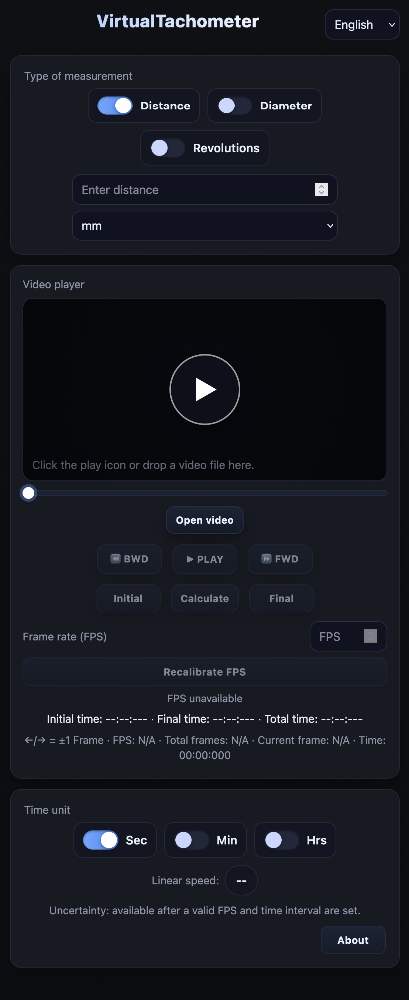

# VirtualTachometer

[](https://github.com/FireRayo/VirtualTachometer)
[](https://github.com/FireRayo/VirtualTachometer)
[](LICENSE)

**VirtualTachometer** is a browser-based industrial tachometer for measuring **linear speed** and **rotational speed (RPM)** from recorded video.

It is designed for field work, commissioning, troubleshooting, maintenance, and machine validation when a physical tachometer is not available but a video can be recorded with a phone, camera, or other device.

**Live application:**  
https://firerayo.github.io/VirtualTachometer/

**Author:** Raymundo Ortiz  
**Current version:** V3.7

---

## Overview

VirtualTachometer converts the elapsed time between two selected video frames into a speed value.

Typical industrial applications include:

- Conveyor speed measurement
- Package or bottle transport verification
- Roller peripheral speed measurement
- Shaft, pulley, wheel, or roller RPM measurement
- Commissioning and troubleshooting of industrial machinery
- Comparing commanded speed with observed mechanical speed

The application runs directly in a modern browser using HTML5, CSS, and JavaScript. Video processing remains local to the browser.

---

## What's new in V3.7

V3.7 keeps the measurement engine introduced in V3.x and refines timing, frame navigation, usability, and controls.

### Improved frame timing

For compatible MP4 / M4V / MOV files, VirtualTachometer reads timing information directly from the container:

- `mdhd` — media timescale
- `stts` — sample timing
- `ctts` — composition offsets when present
- common `elst` edit-list timing when present
- real sample timestamps when a usable timing table can be built

When real sample timestamps are available, frame navigation uses those timestamps instead of relying only on `1 / FPS`.

### CFR and VFR handling

- Constant Frame Rate (CFR) video is supported normally.
- Variable Frame Rate (VFR) is detected from the timing table.
- For VFR files with a usable sample-time table, BWD/FWD uses the actual sample timestamps.
- If exact VFR sample timing is unavailable, frame stepping is disabled instead of pretending that average FPS is exact.

### Presented-frame confirmation

When supported, VirtualTachometer uses:

```text
requestVideoFrameCallback()
```

and the reported:

```text
mediaTime
```

to identify the frame actually presented by the browser.

After a seek, the application waits for frame confirmation before enabling **Start** and **End** whenever possible.

If the browser does not confirm the displayed frame in time, V3.7 falls back to `video.currentTime` as an **approximate frame** so Start/End do not remain permanently unavailable.

### Stable seeking

Frame navigation includes:

- Seek locking
- Latest-wins slider behavior
- Post-seek frame validation
- Seek timeout recovery
- Corrective seek attempts when the browser lands on a different frame
- Approximate timestamp fallback when frame confirmation is unavailable

### Multiple revolutions

Both **Diameter** and **Revolutions** modes support multiple observed revolutions.

This allows longer measurement intervals and reduces the relative influence of frame timing resolution.

### Updated controls

The main playback controls now use **Google Material Symbols Rounded**:

- `play_circle`
- `pause_circle`
- `fast_forward`
- `fast_rewind`

The visible measurement/action labels remain consistent across languages:

- **Open Video**
- **Start**
- **Compute**
- **End**
- **Autotune**

The interface still supports English, Spanish, and Italian for the remaining UI text and accessibility labels.

---

## Main features

- Runs directly in a modern web browser
- Single-file HTML5 application
- No installation required
- No backend or account required
- Video remains local to the browser
- Drag-and-drop video loading
- Distance, Diameter, and Revolutions modes
- Linear speed calculation
- Roller peripheral speed calculation
- RPM calculation
- Multiple-revolution measurements
- Frame-by-frame BWD/FWD navigation
- Keyboard `←` / `→` frame stepping
- Progress slider with controlled asynchronous seeking
- MP4/MOV timing-table inspection
- CFR/VFR detection
- Real sample timestamp navigation when available
- Manual FPS entry
- Explicit FPS autotuning
- `requestVideoFrameCallback()` frame confirmation when available
- Approximate fallback when frame confirmation is unavailable
- Timing-resolution estimate
- Video decoding/error messages
- English, Spanish, and Italian interface
- Persistent preferences with `localStorage`
- Responsive desktop/mobile layout

---

## Screenshot



> The screenshot may show an earlier visual revision. The live GitHub Pages version reflects the current interface.

---

# Measurement modes

## 1. Distance

Use this mode when an object travels a known linear distance.

### Procedure

1. Measure a known physical distance.
2. Record the moving object passing the reference points.
3. Open the video.
4. Select **Distance**.
5. Enter the distance and unit.
6. Navigate to the first reference frame and press **Start**.
7. Navigate to the final reference frame and press **End**.
8. Press **Compute**.

The application calculates:

```text
Elapsed Time = End Time - Start Time

Linear Speed = Distance / Elapsed Time
```

Example:

```text
Distance = 1000 mm
Elapsed Time = 2.000 s

Speed = 500 mm/s
```

---

## 2. Diameter

Use this mode to calculate the peripheral speed of a roller, wheel, pulley, or similar rotating component.

Enter:

- Diameter
- Diameter unit
- Observed revolutions

The calculation is:

```text
Linear Speed =
π × Diameter × Observed Revolutions
-----------------------------------
            Elapsed Time
```

Example:

```text
Diameter = 100 mm
Observed revolutions = 5
Elapsed Time = 2.500 s

Speed ≈ 628.319 mm/s
```

Using several complete revolutions is normally more reliable than measuring only one.

---

## 3. Revolutions

Use this mode to calculate rotational speed directly in RPM.

Enter the number of complete observed revolutions and mark the beginning and end of the interval.

```text
RPM = 60 × Observed Revolutions / Elapsed Time
```

Example:

```text
Observed revolutions = 10
Elapsed Time = 4.000 s

RPM = 150 RPM
```

---

# Supported units

Distance and diameter fields support:

| Metric | Imperial / US customary |
|---|---|
| mm | in |
| cm | ft |
| m | yd |
| km | mi |

Time basis:

- `/s`
- `/min`
- `/h`

Rotational speed is displayed in:

```text
RPM
```

---

# FPS and frame navigation

## Why FPS matters

For CFR video, the nominal frame duration is approximately:

```text
Frame duration ≈ 1 / FPS
```

| FPS | Approx. frame duration |
|---:|---:|
| 24 | 41.67 ms |
| 25 | 40.00 ms |
| 30 | 33.33 ms |
| 50 | 20.00 ms |
| 60 | 16.67 ms |
| 120 | 8.33 ms |
| 240 | 4.17 ms |

VirtualTachometer does **not** silently assume 30 FPS when the frame rate is unknown.

FPS can come from:

- MP4/MOV container timing
- Manual entry
- **Autotune**

---

## MP4/MOV timing analysis

For compatible ISO Base Media / QuickTime-style files, VirtualTachometer inspects the video track timing directly.

Where available, it can build a sample-time table from container metadata and use it for frame navigation.

This is especially important for VFR content because:

```text
1 / average FPS
```

does not represent every individual frame interval.

Fragmented MP4 files that do not expose a complete timing table in `moov` are handled conservatively: the application does not claim exact frame stepping when the required timing information is unavailable.

---

# Accuracy and timing resolution

Video-based measurement is inherently limited by the temporal resolution of the recording.

For CFR video:

```text
Approximate one-frame duration = 1 / FPS
```

V3.7 estimates timing resolution from the local frame duration around the Start and End marks when sample timestamps are available.

The displayed estimate does **not** include every possible physical source of error, such as:

- Browser seek behavior
- Motion blur
- Camera exposure
- Rolling shutter
- Reference-mark selection error
- Incorrect physical distance or diameter
- Video encoding artifacts

For better measurements:

1. Use the highest practical FPS.
2. Prefer CFR video when possible.
3. Measure over a longer interval.
4. Use several complete revolutions.
5. Keep the camera stable.
6. Use clear, high-contrast reference marks.
7. Avoid excessive motion blur.

---

# Frame-accurate behavior: important limitation

VirtualTachometer improves frame navigation by using container sample timestamps and `requestVideoFrameCallback()` when available, but video decoding still relies on the browser's HTML `<video>` implementation.

A seek such as:

```javascript
video.currentTime = target;
```

is not guaranteed to provide deterministic, sample-exact seeking for every codec, GOP structure, browser, or file.

Therefore:

- Frame stepping is best effort at the browser level.
- Long-GOP H.264/H.265 files may be slower when stepping backward.
- Browser codec and container support still apply.
- A confirmed `mediaTime` is preferred when available.
- Approximate `currentTime` is used as a fallback when necessary.

A future architecture requiring deterministic decoded-frame indexing would require a dedicated demuxer and decoder, such as a WebCodecs-based pipeline.

---

# Controls

## Video

- **Open Video** — select a local video file
- **Play Circle** — start playback
- **Pause Circle** — pause playback
- **Fast Rewind** — request one frame backward
- **Fast Forward** — request one frame forward
- **← / →** — keyboard frame navigation
- **Progress bar** — seek through the video

The four playback/navigation buttons are displayed using Google Material Symbols.

## Measurement

- **Start** — store the starting timestamp
- **End** — store the ending timestamp
- **Compute** — calculate elapsed time and speed

## FPS

- **Frame rate (FPS)** — detected or manually entered frame rate
- **Autotune** — explicitly estimate FPS from displayed-frame timing when supported

---

# Video compatibility

The application accepts video files supported by the current browser.

Automatic container timing analysis is specifically implemented for compatible:

```text
.mp4
.m4v
.mov
.qt
```

Other formats may still play if supported by the browser, but FPS or sample timing may need to be entered or estimated manually.

Common MP4/H.264 video generally provides the widest browser compatibility.

---

# Privacy

VirtualTachometer processes the selected video locally in the browser.

The application does not require a backend and does not intentionally upload the selected video to a server.

Users should still follow their organization's security and data-handling policies.

---

# Installation

No installation is required.

## Option 1 — Use online

https://firerayo.github.io/VirtualTachometer/

## Option 2 — Run locally

Download:

```text
index.html
```

and open it in a modern browser.

The application itself is a single HTML file. V3.7 uses the **Google Material Symbols Rounded** web font for the playback/navigation icons, so those icons require internet access unless the font is already cached by the browser.

## Option 3 — Clone the repository

```bash
git clone https://github.com/FireRayo/VirtualTachometer.git
cd VirtualTachometer
```

Then open:

```text
index.html
```

---

# Repository structure

```text
VirtualTachometer/
├── index.html
├── README.md
├── LICENSE
└── assets/
    └── IMG01.JPG
```

---

# Browser notes

VirtualTachometer is intended for modern browsers with HTML5 video support.

The best frame-awareness is available when the browser supports:

```javascript
HTMLVideoElement.requestVideoFrameCallback()
```

If this API is unavailable, the application continues using HTML video timing with reduced presented-frame awareness.

---

# Version history

## V3.7

- Updated playback/navigation controls to Google Material Symbols Rounded.
- Play/Pause dynamically switches between `play_circle` and `pause_circle`.
- BWD/FWD use `fast_rewind` and `fast_forward`.
- Preserved frame-stepping logic and accessibility labels.

## V3.6

- Fixed Start/End becoming unavailable after some FWD/BWD operations.
- Added approximate `currentTime` fallback when presented-frame confirmation times out.
- Start/End remain usable after seek recovery.

## V3.5

- Standardized playback text internally to PLAY / PAUSE before the icon-based V3.7 interface.

## V3.1–V3.2 timing improvements

- Added real sample timestamp tables for compatible MP4/MOV files.
- Added `ctts` composition-offset handling.
- Added common `elst` edit-list handling.
- Improved VFR navigation.
- Added post-seek frame confirmation and corrective seeking.
- Added seek timeout recovery.
- Added multiple revolutions to Diameter mode.
- Improved timing-resolution reporting.
- Preserved exact container frame counts when available.
- Removed silent nominal FPS snapping from calibrated FPS.

## V3.0

- Redesigned FPS handling.
- Added MP4/MOV timing-table FPS detection.
- Added VFR detection.
- Removed hidden 30 FPS fallback.
- Added manual FPS entry and explicit FPS recalibration.
- Added seek locking and latest-wins slider behavior.
- Added `requestVideoFrameCallback()` timestamp tracking.
- Added multiple observed revolutions for RPM measurement.
- Added persistent preferences through `localStorage`.
- Added English, Spanish, and Italian interfaces.

---

# License

This project is licensed under the **GNU General Public License v3.0 (GPL-3.0)**.

See [LICENSE](LICENSE).

---

# Author

**Raymundo Ortiz**

GitHub:  
https://github.com/FireRayo

Project repository:  
https://github.com/FireRayo/VirtualTachometer

Live application:  
https://firerayo.github.io/VirtualTachometer/

---

## Disclaimer

VirtualTachometer is a measurement aid based on recorded video timing.

Results can be affected by frame rate, variable frame timing, compression, dropped frames, motion blur, camera exposure, browser decoding behavior, seek accuracy, and the user's selection of Start and End frames.

For safety-critical calibration, certification, regulatory verification, or metrology applications, use properly calibrated measurement equipment and an appropriate validated measurement procedure.
